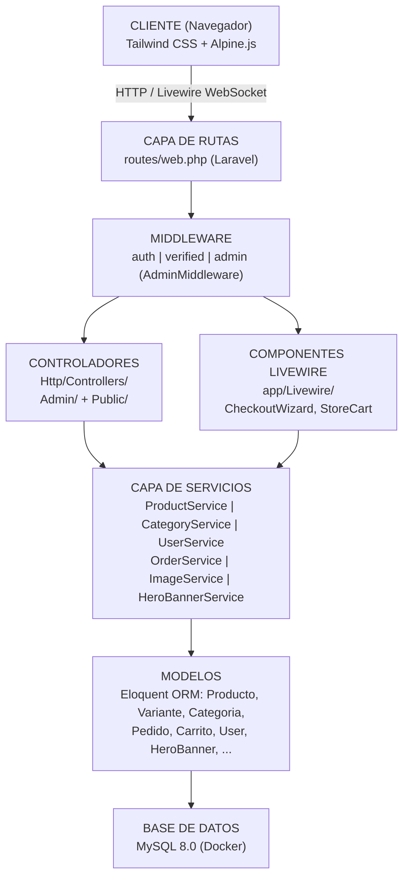
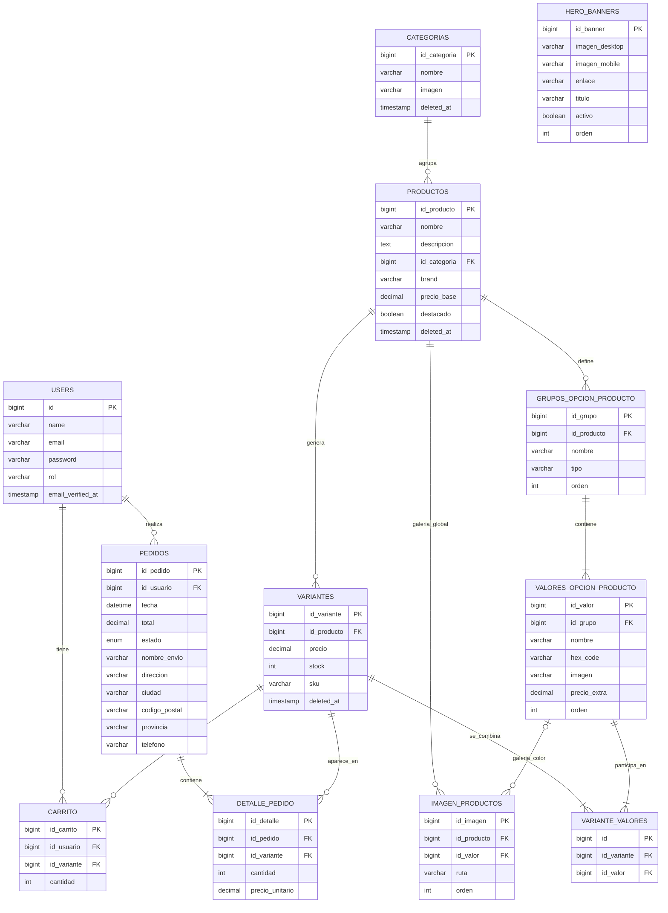
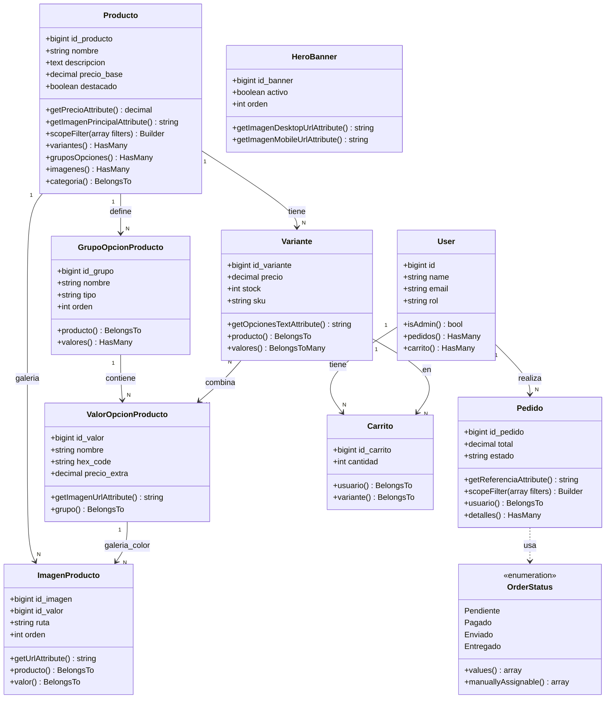
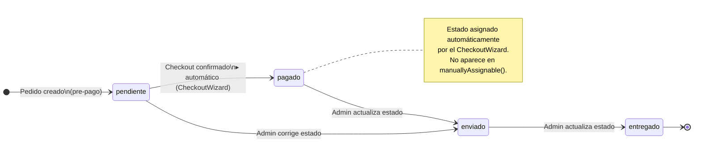
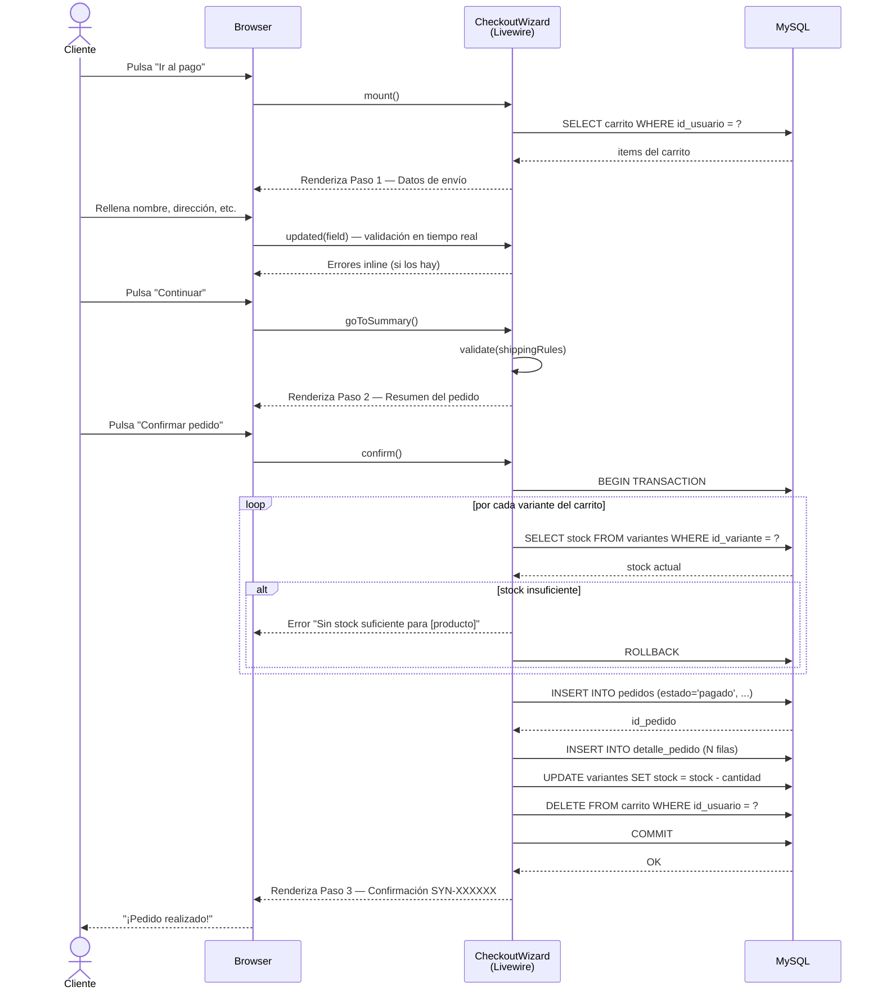
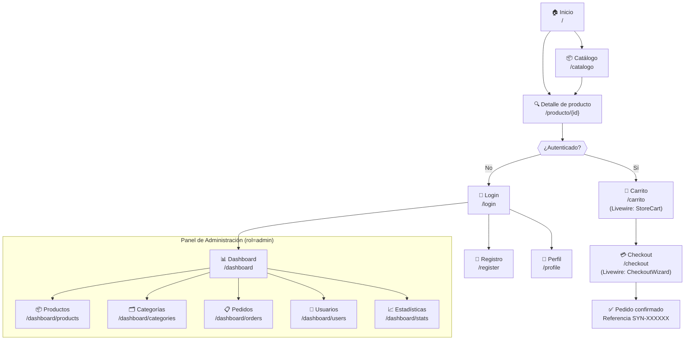
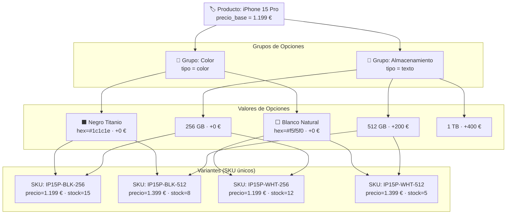
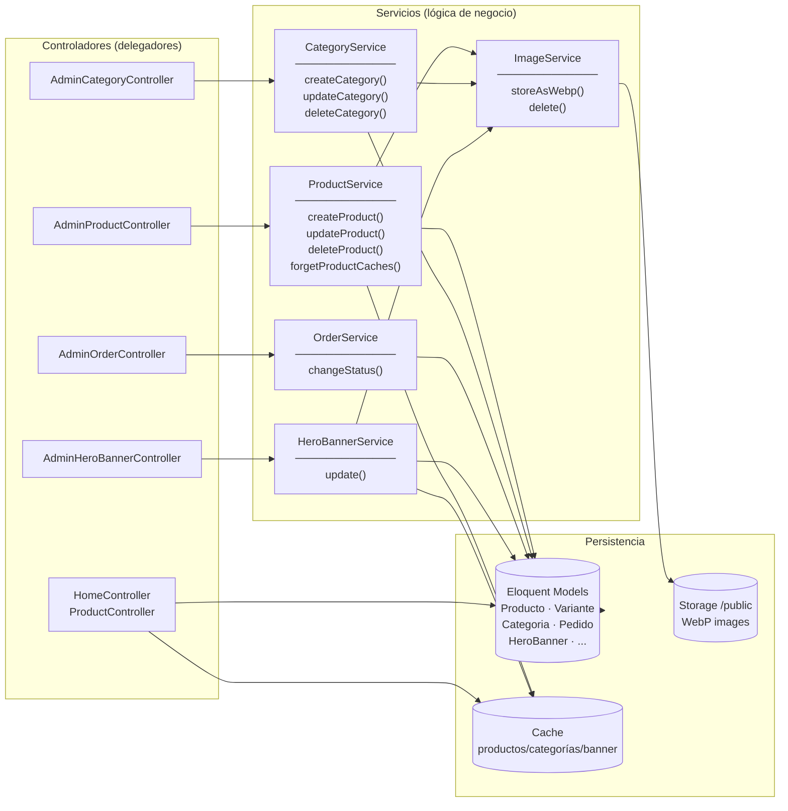
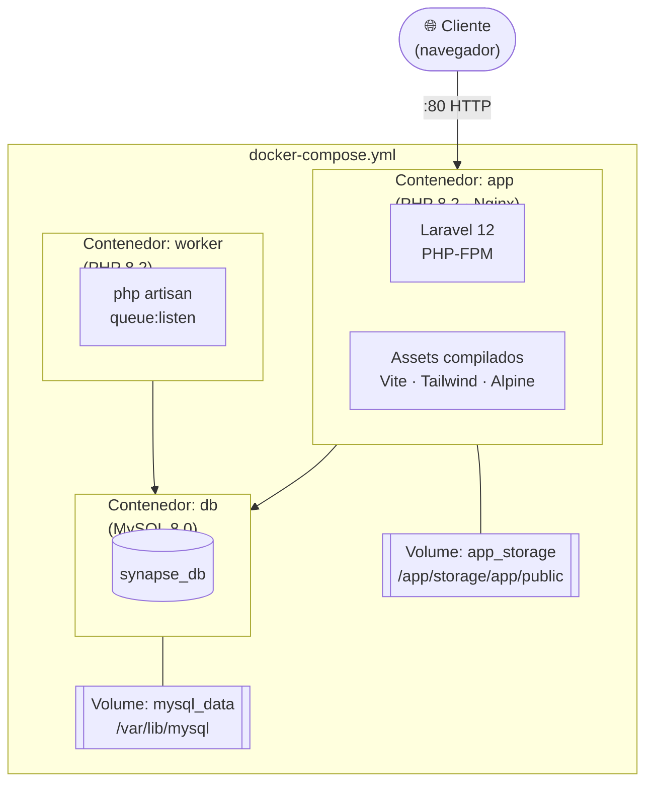
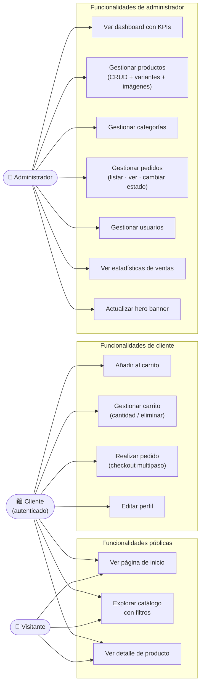

# Diagramas del Proyecto — Tienda Web Synapse

Todos los diagramas están escritos en **Mermaid**.
Para renderizarlos puedes usar:

- [mermaid.live](https://mermaid.live) (online, copiar y pegar)
- VS Code con la extensión **Markdown Preview Mermaid Support**
- GitHub (los renderiza automáticamente en cualquier `.md`)

---

## 1. Arquitectura General del Sistema

---

## 2. Diagrama Entidad-Relación (ER)

---

## 3. Diagrama de Clases — Modelos Eloquent principales

---

## 4. Diagrama de Estados del Pedido

---

## 5. Diagrama de Secuencia — Proceso de Compra (Checkout)

---

## 6. Diagrama de Flujo — Navegación de la Aplicación

---

## 7. Diagrama del Sistema de Variantes (Modelo Flexible)

Ejemplo con un iPhone 15 Pro para ilustrar cómo funciona el modelo de 4 tablas.

---

## 8. Diagrama de la Capa de Servicios

---

## 9. Diagrama de Infraestructura Docker

---

## 10. Diagrama de Casos de Uso

